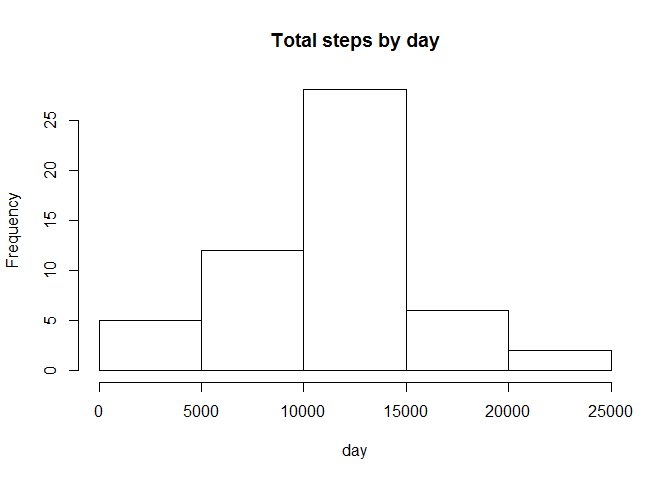
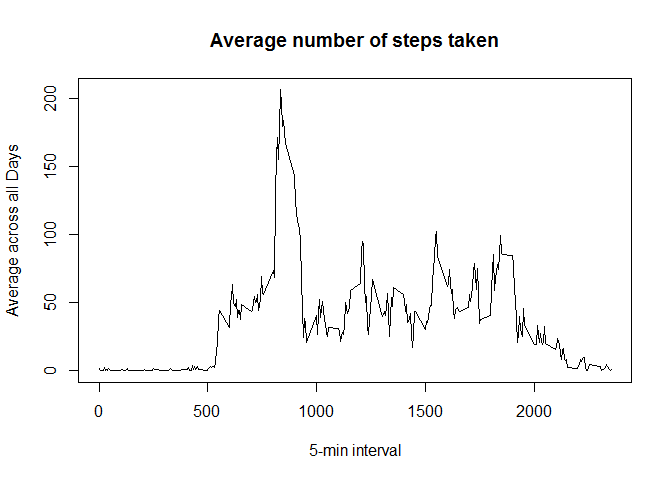
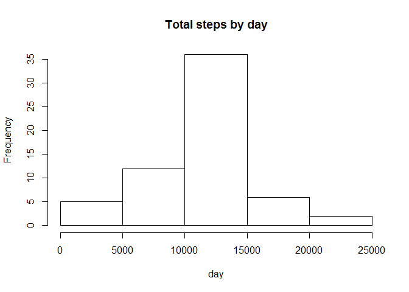

# Reproducible Research: Peer Assessment 1


## Loading and preprocessing the data
First we'll load the libraries needed.  

```r
library(lubridate)
library(lattice)
```

The zipped data file is assumed to be extracted into active working directory. Data is loaded from the extracted file, NA values are excluded and date is converted to proper format.  


```r
data <- read.csv("activity.csv", na.strings = "NA")
data<-na.omit(data)
data$date <- ymd(data$date)
```


## What is mean total number of steps taken per day?
Histogram of total number of steps taken each day

```r
StepsDay <- aggregate(steps ~ date, data, sum)
hist(StepsDay$steps, main = "Total steps by day", xlab = "day")
```

 

```r
Mean1 <- mean(StepsDay$steps)
Median1 <- median(StepsDay$steps)
```
Total number of steps taken per day:  
**Mean: ** 1.0766189\times 10^{4}
**Median: ** 10765

## What is the average daily activity pattern?
Make a time series plot of the 5-minute interval (x-axis) and the average number of steps taken, averaged across all days (y-axis)


```r
pattern <- tapply(data$steps, data$interval, mean)
plot(row.names(pattern), pattern, type = "l", xlab = "5-min interval", ylab = "Average across all Days", main = "Average number of steps taken")
```

 

```r
MaxInterval <- which.max(pattern)
MxInt <- names(MaxInterval)
```
The 5-minute interval, on average across all the days in the dataset, which contains the maximum number of steps is **835**


## Imputing missing values
Introducing missing values back into dataset, replacing them with *mean* value and creating a new data set. 


```r
data <- read.csv("activity.csv", na.strings = "NA")
Msing <- sum(is.na(data$steps))

avg <- aggregate(steps ~ interval, data, mean, na.rm=TRUE)
fill.value <- function(steps, interval) {
    filled <- NA
    if (!is.na(steps))
        filled <- c(steps)
    else
        filled <- (avg[avg$interval==interval, "steps"])
    return(filled)
}
filled.data <- data
filled.data$steps <- mapply(fill.value, filled.data$steps, filled.data$interval)
```
Total number of missing values in dataset is **2304**

A histogram of the total number of steps taken each day


```r
StepsDay <- aggregate(steps ~ date, filled.data, sum)
hist(StepsDay$steps, main = "Total steps by day", xlab = "day")
```

 

```r
Mean2 <- mean(StepsDay$steps)
Median2 <- median(StepsDay$steps)
```
Total number of steps taken per day - with & Without missing values:  
**Mean without missing values: ** 1.0766189\times 10^{4}   
**Median without missing values: ** 10765  
**Mean with missing values: ** 1.0766189\times 10^{4}   
**Median with missing values: ** 1.0766189\times 10^{4}  


## Are there differences in activity patterns between weekdays and weekends?
Created a new factor variable indicating weekday or weekend and introduced into data set.


```r
IsWeekday <- function(date) {
    day <- weekdays(date)
    if (day %in% c("Monday", "Tuesday", "Wednesday", "Thursday", "Friday"))
        return("weekday")
    else return("weekend")
}
filled.data$date <- as.Date(filled.data$date)
filled.data$day <- sapply(filled.data$date, IsWeekday)
```
A panel plot containing a time series plot of the 5-minute interval (x-axis) and the average number of steps taken, averaged across all weekday days or weekend days (y-axis).


```r
StepsDay <- aggregate(steps ~ interval + day, filled.data, mean)
xyplot(steps ~ interval | day, StepsDay, type = "l", layout = c(1, 2), xlab = "Interval", ylab = "Number of steps")
```

 
